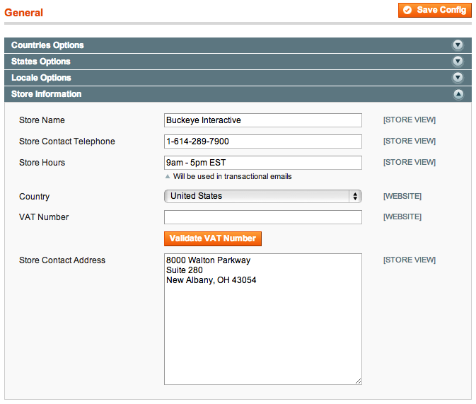

# Store Hours Magento extension

This Magento extension adds a "Store Hours" field to System &rsaquo; Configuration &rsaquo; General &rsaquo; Store Information. With this field in place a variable like `{{config path='general/store_information/store_hours'}}` can be added to transactional email templates. No more hard-coding hours across eight different templates!

## Installation

1. Copy the following files/directories from the repository into their corresponding locations in your Magento installation
  * app/code/local/Bii/StoreHours/
  * app/etc/modules/Bii_StoreHours.xml

2. Clear Magento's cache, log out, then log back into the Magento administration area.
3. Visit System &rsaquo; Configuration &rsaquo; General; there should be a "Store Hours" field under the "Store Information" heading. 

## Usage

After setting your store hours, update your email templates (System &rsaquo; Transactional Emails) to use `{{config path='general/store_information/store_hours'}}` anywhere that you'd like to display your store hours.

For a full explanation of the extension's usage please read ["Set store hours in Magento admin area" on the Buckeye Interactive blog](http://www.buckeyeinteractive.com/2013/07/store-hours-in-magento-admin/).

## License

This extension is available under the [GNU General Public License](http://www.gnu.org/licenses/gpl.html).

Copyright (C) 2013  Buckeye Innovation LLC

This program is free software: you can redistribute it and/or modify
it under the terms of the GNU General Public License as published by
the Free Software Foundation, either version 3 of the License, or
(at your option) any later version.

This program is distributed in the hope that it will be useful,
but WITHOUT ANY WARRANTY; without even the implied warranty of
MERCHANTABILITY or FITNESS FOR A PARTICULAR PURPOSE.  See the
GNU General Public License for more details.

You should have received a copy of the GNU General Public License
along with this program.  If not, see [http://www.gnu.org/licenses/](http://www.gnu.org/licenses/).